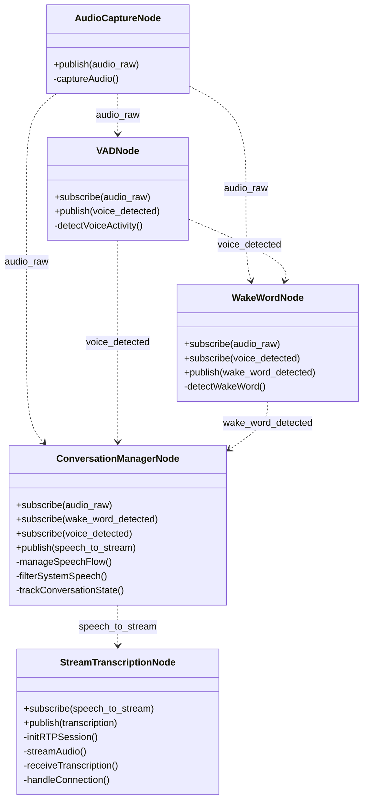

```mermaid
classDiagram
    class AudioCaptureNode {
        +publish(audio_raw)
        -captureAudio()
    }
    
    class VADNode {
        +subscribe(audio_raw)
        +publish(voice_detected)
        -detectVoiceActivity()
    }
    
    class WakeWordNode {
        +subscribe(audio_raw)
        +subscribe(voice_detected)
        +publish(wake_word_detected)
        -detectWakeWord()
    }
    
    class ConversationManagerNode {
        +subscribe(audio_raw)
        +subscribe(wake_word_detected)
        +subscribe(voice_detected)
        +publish(speech_to_stream)
        -manageSpeechFlow()
        -filterSystemSpeech()
        -trackConversationState()
    }

    class StreamTranscriptionNode {
        +subscribe(speech_to_stream)
        +publish(transcription)
        -initRTPSession()
        -streamAudio()
        -receiveTranscription()
        -handleConnection()
    }

    AudioCaptureNode ..> VADNode : audio_raw
    AudioCaptureNode ..> WakeWordNode : audio_raw
    AudioCaptureNode ..> ConversationManagerNode : audio_raw
    
    VADNode ..> WakeWordNode : voice_detected
    VADNode ..> ConversationManagerNode : voice_detected
    
    WakeWordNode ..> ConversationManagerNode : wake_word_detected
    
    ConversationManagerNode ..> StreamTranscriptionNode : speech_to_stream

    %% note for StreamTranscriptionNode "Handles RTP streaming\nManages server connection\nReceives transcriptions"
```
