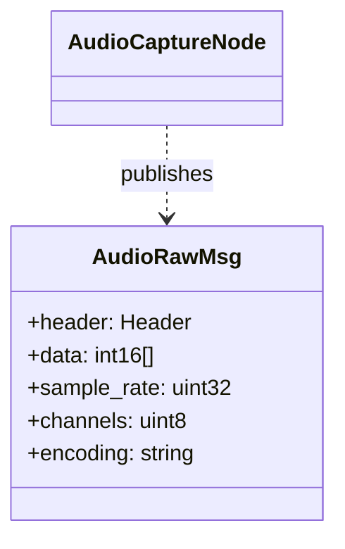
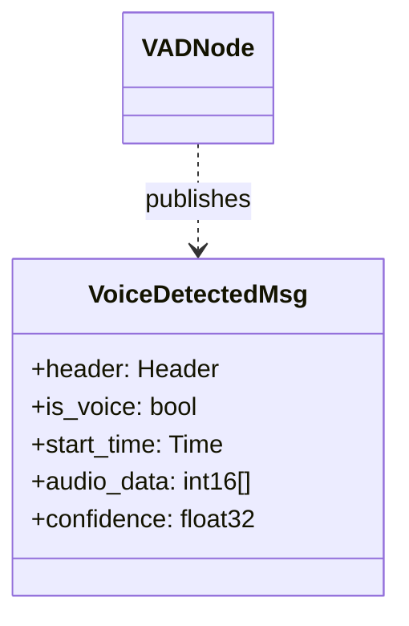
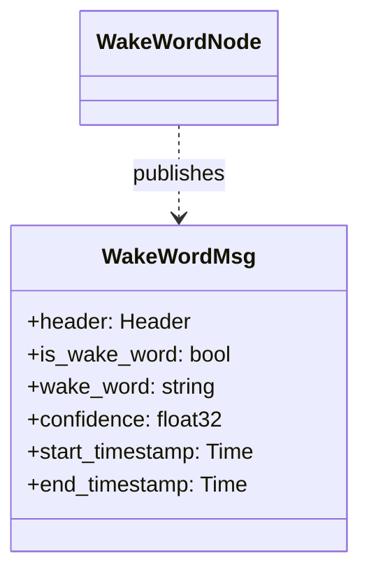
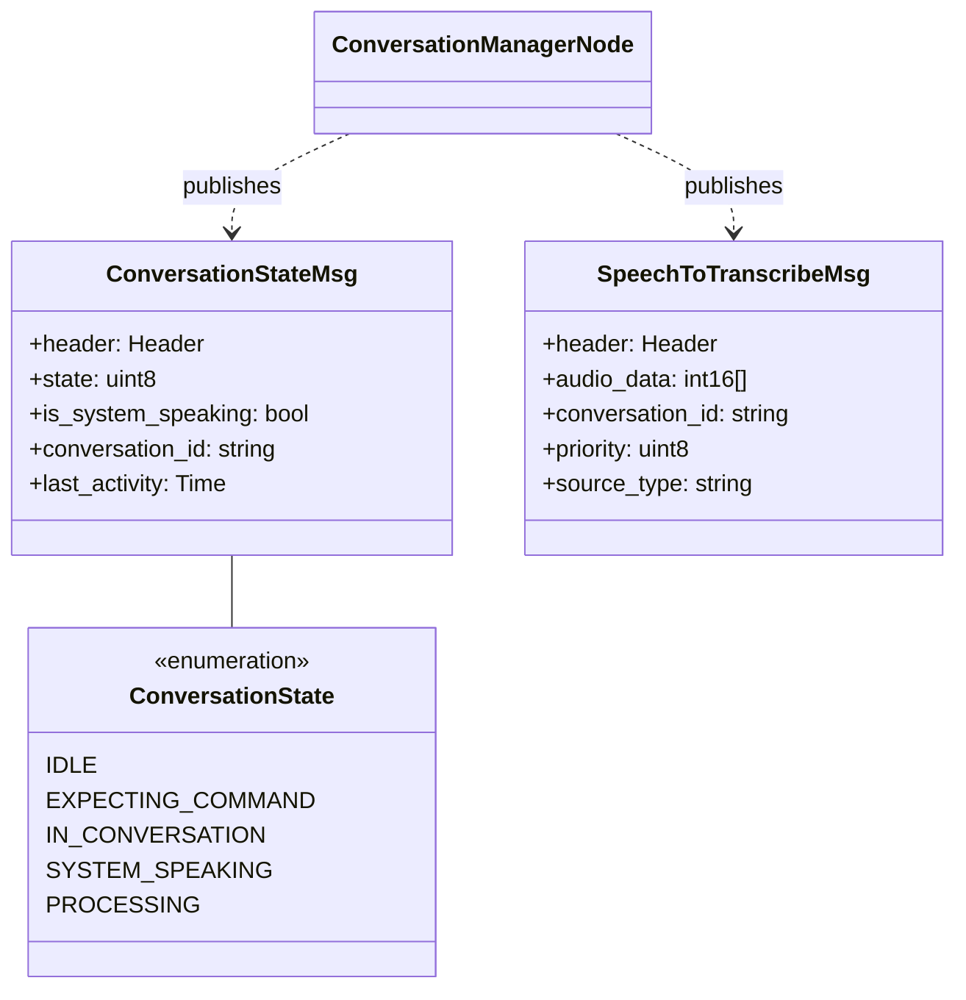
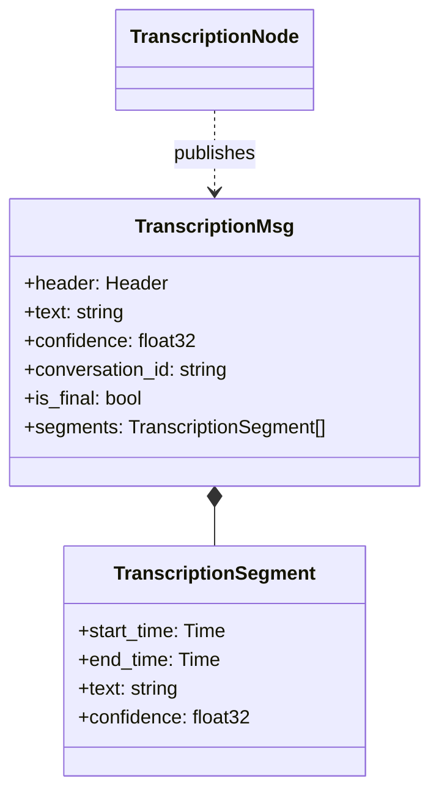

```mermaid
classDiagram
    %% Message Types
    class AudioRawMsg {
        +header: Header
        +data: int16[]
        +sample_rate: uint32
        +channels: uint8
        +encoding: string
    }
    AudioCaptureNode ..> AudioRawMsg : publishes
```

```mermaid
classDiagram
    %% Message Types
    class VoiceDetectedMsg {
        +header: Header
        +is_voice: bool
        +start_time: Time
        +audio_data: int16[]
        +confidence: float32
    }
    %% Node connections to messages
    VADNode ..> VoiceDetectedMsg : publishes
```    

```mermaid
classDiagram
    %% Message Types
    class WakeWordMsg {
        +header: Header
        +is_wake_word: bool
        +wake_word: string
        +confidence: float32
        +start_timestamp: Time
        +end_timestamp: Time
    }
    %% Node connections to messages
    WakeWordNode ..> WakeWordMsg : publishes
``` 

```mermaid
classDiagram
    %% Message Types
    class ConversationStateMsg {
        +header: Header
        +state: uint8
        +is_system_speaking: bool
        +conversation_id: string
        +last_activity: Time
    }
    class SpeechToTranscribeMsg {
        +header: Header
        +audio_data: int16[]
        +conversation_id: string
        +priority: uint8
        +source_type: string
    }
    class ConversationState {
        <<enumeration>>
        IDLE
        EXPECTING_COMMAND
        IN_CONVERSATION
        SYSTEM_SPEAKING
        PROCESSING
    }

    %% Relationships
    ConversationStateMsg -- ConversationState

    %% Node connections to messages
    ConversationManagerNode ..> ConversationStateMsg : publishes
    ConversationManagerNode ..> SpeechToTranscribeMsg : publishes
```

```mermaid
classDiagram
    %% Message Types
    class TranscriptionMsg {
        +header: Header
        +text: string
        +confidence: float32
        +conversation_id: string
        +is_final: bool
        +segments: TranscriptionSegment[]
    }

    class TranscriptionSegment {
        +start_time: Time
        +end_time: Time
        +text: string
        +confidence: float32
    }

    %% Relationships
    TranscriptionMsg *-- TranscriptionSegment

    %% Node connections to messages
    TranscriptionNode ..> TranscriptionMsg : publishes    
``` 
